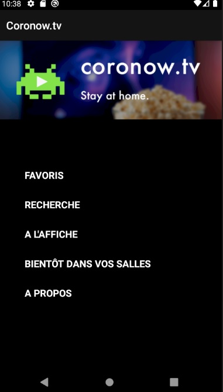
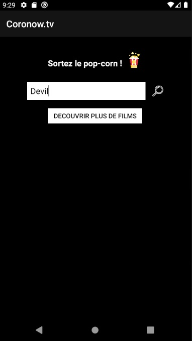
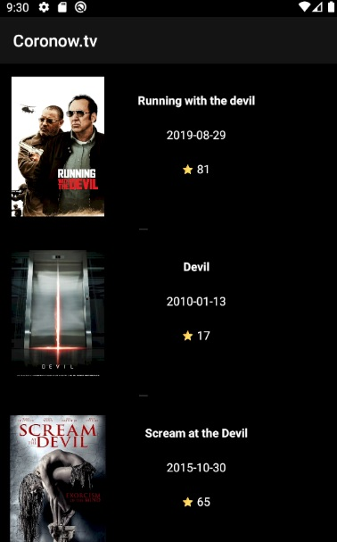
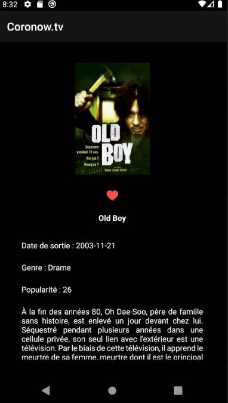
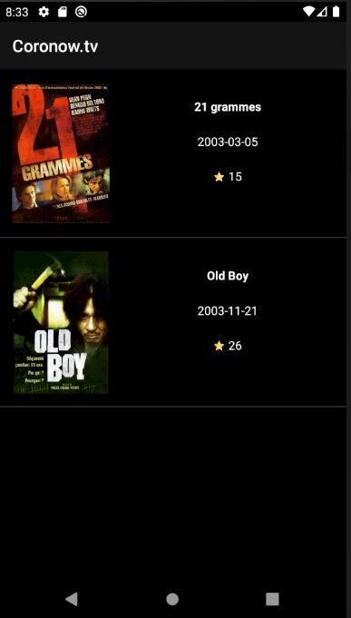
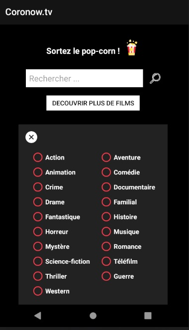

# appliTv
ivann.galic@edu.itescia.fr

## Description

This is a school project , Mobile app's examination.
The project allows to manage movies with requesting https://www.themoviedb.org/ Api.
You can search movie by title. And you can discover new movies by sorting them by genre, year, etc.
We used different libs:
Retrofit for the API's calls,
Room to storage on the phone,
Picasso to manage pictures.

## Installation

Open android studio , choose open and select ApplicationTvGoodGit. 
Setup Sdk with android sdk.

## Application

Home screen

Search activity

Add movie to favorites 

Display favorites list

Discover new movies sort by genre

